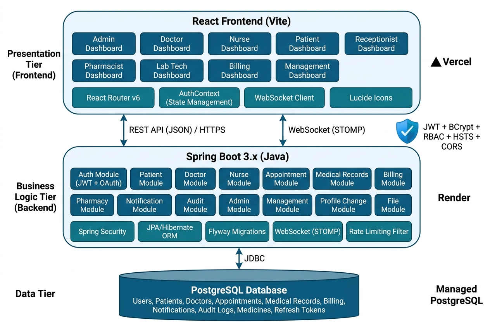

# Patient Management System

---

## Team
- **E/22/364** – S.M.L.E Senadhipathi ([e22364@eng.pdn.ac.lk](mailto:e22364@eng.pdn.ac.lk))
- **E/22/125** – D.D.S.K. Gunawardhana ([e22125@eng.pdn.ac.lk](mailto:e22125@eng.pdn.ac.lk))
- **E/22/159** – G.K.M. Jayanga ([e22159@eng.pdn.ac.lk](mailto:e22159@eng.pdn.ac.lk))
- **E/22/004** – D.D. Abeysinghe ([e22004@eng.pdn.ac.lk](mailto:e22004@eng.pdn.ac.lk))

---

## Table of Contents
1. [Introduction](#introduction)
2. [Solution Architecture](#solution-architecture)
3. [Software Designs](#software-designs)
4. [Testing](#testing)
5. [Technology Stack](#technology-stack)
6. [Deployment](#deployment)
7. [Conclusion](#conclusion)
8. [Links](#links)

---

## Introduction

Healthcare facilities still face problems such as paper-based records, scattered patient information, appointment conflicts, and limited access to medical history. These issues can lead to delays in treatment, data loss, and poor patient experience.

The **Patient Management System (PMS)** is a full-stack web application designed to manage patient records, medical history, appointments, billing, pharmacy, and clinical workflows in a centralized system. The system provides a secure, role-based platform for healthcare staff and patients to access and update information efficiently.

The system supports **10 distinct user roles** — Super Admin, Admin, Management, Doctor, Nurse, Receptionist, Pharmacist, Lab Technician, Billing Staff, and Patient — each with a dedicated dashboard and tailored permissions. It improves data accuracy, reduces manual work, and supports better decision-making by healthcare providers.

---

## Solution Architecture

### Architecture Overview

The system follows a **three-tier client-server architecture** with a clear separation between the presentation, business logic, and data layers.

#### Frontend (React + Vite)
- Single-page application with role-based routing and dashboards
- 10 role-specific dashboard views with dedicated sub-components
- Patient registration, appointment scheduling, billing, and medical record interfaces
- Real-time notifications via WebSocket
- Responsive UI built with Tailwind CSS

#### Backend (Spring Boot)
- 18 modular packages following a layered architecture (Controller → Service → Repository → Entity)
- RESTful API endpoints with method-level security (`@PreAuthorize`)
- JWT-based stateless authentication with refresh token support
- OTP-based email verification via Resend API
- Rate limiting filter to prevent brute-force attacks
- WebSocket support for real-time notifications
- Flyway database migrations for version-controlled schema management

#### Database (PostgreSQL)
- Stores patient data, medical records, appointments, billing (invoices, pending items), pharmacy (medicines), notifications, audit logs, and user data
- Managed schema migrations via Flyway
- SSL-enforced connections in production

#### Security
- JWT access tokens + refresh tokens for stateless authentication
- BCrypt password hashing
- Role-based access control (RBAC) with 10 roles
- Email OTP verification for signup
- Account lockout after failed login attempts
- Rate limiting on authentication endpoints
- CORS configuration and security headers
- HTTPS-enforced communication in production

---

## Software Designs

### 1. System Modules

#### 1.1 Patient Management Module
- Create, update, and search patient records
- Store demographic and emergency contact details
- Handle duplicate patient detection
- Patient self-service dashboard for viewing records and booking appointments

#### 1.2 Medical Records Module
- Store medical history, allergies, diagnoses, and treatments
- Manage prescriptions and clinical notes
- Attach and manage medical documents and reports (file upload service)
- Support multiple record types (Lab Results, Prescriptions, Clinical Notes, etc.)

#### 1.3 Appointment Management Module
- Schedule, reschedule, and cancel appointments
- Track appointment history and attendance
- Manage provider (doctor) availability
- Patient-facing appointment booking interface
- Receptionist scheduling and overview panels

#### 1.4 User & Access Control Module
- User signup with OTP email verification
- Login with email/password and Google authentication
- Role-based access with 10 roles: Super Admin, Admin, Management, Doctor, Nurse, Receptionist, Pharmacist, Lab Technician, Billing Staff, Patient
- Admin-managed user approval and activation/deactivation
- Profile change request workflow
- Audit logs for all data access and changes

#### 1.5 Billing & Invoicing Module
- Pending bill item management (charges added by doctors, nurses, pharmacists)
- Invoice generation and finalization
- Line-item invoice breakdown
- Billing staff dashboard with full billing pipeline
- Receptionist billing overview and invoice creation
- Payment tracking and billing history

#### 1.6 Pharmacy Module
- Medicine inventory management
- Prescription-linked dispensing workflow
- Pharmacist dashboard for managing prescriptions

#### 1.7 Lab & Diagnostics Module
- Lab technician dashboard for entering and managing lab results
- Integration with medical records for result attachment

#### 1.8 Notification Module
- In-app notifications with multiple notification types
- Real-time delivery via WebSocket
- Notification history and management

#### 1.9 Reporting & Management Module
- Management dashboard with user and staff management
- Administrative and statistical reports
- Patient summaries and clinical reports

---

### 2. Database Design

#### Key Entities
- **User** – id, firstName, lastName, email, mobileNumber, passwordHash, role, isActive, emailVerified, failedLoginAttempts, lockedUntil, createdAt, updatedAt
- **Patient** – Demographic details, emergency contacts, linked user account
- **Appointment** – Patient, doctor, date/time, status, notes
- **MedicalRecord** – Patient-linked records with record types (Lab Results, Prescriptions, Clinical Notes, etc.)
- **Invoice** – Patient-linked invoices with line items and totals
- **InvoiceItem** – Individual charges within an invoice
- **PendingBillItem** – Charges awaiting invoice finalization
- **Medicine** – Pharmacy inventory with name, dosage, and stock
- **Notification** – User notifications with type and read status
- **AuditLog** – Action tracking for data access and modifications
- **EmailOtp** – OTP codes for email verification
- **RefreshToken** – JWT refresh token storage

#### Relationships
- One user → one role (enum-based)
- One patient → many appointments
- One patient → many medical records
- One patient → many invoices
- One invoice → many invoice items
- One patient → many pending bill items
- One user → many notifications
- One user → many audit log entries

---

### 3. Security Design
- **Authentication**: JWT access tokens (short-lived) + refresh tokens (long-lived), OTP email verification
- **Password Security**: BCrypt hashing with configurable strength
- **Authorization**: Role-based access control with method-level `@PreAuthorize` annotations
- **Account Protection**: Auto-lockout after repeated failed login attempts
- **API Security**: Rate limiting filter, CORS configuration, stateless session management
- **Data Privacy**: Audit logging of all sensitive operations, encrypted database connections (SSL)
- **Security Headers**: Referrer policy, content security headers

---

## Testing

### Testing Approach
The project implements a comprehensive multi-layered testing strategy covering unit, integration, and security testing.

### Types of Testing

#### Unit Testing (16 test suites)
- **Service Layer Tests**: AdminServiceTest, AppointmentServiceTest, AuthServiceTest, BillingServiceWorkflowTest, DoctorServiceTest, FileServiceTest, ManagementServiceTest, MedicalRecordServiceWorkflowTest, NotificationServiceTest, NurseServiceWorkflowTest, PatientServiceTest, PharmacyServiceTest, ProfileChangeRequestServiceTest
- **Security Tests**: JwtUtilTest, OtpServiceTest, RateLimitingFilterTest
- Validated business logic, input data, and edge cases across all modules

#### Integration Testing (5 test suites, PostgreSQL Testcontainers)
- **AppointmentLifecycleIntegrationTest** – End-to-end appointment booking, rescheduling, and cancellation
- **BillingPipelineIntegrationTest** – Full billing workflow from pending items to finalized invoices
- **FlywayMigrationIntegrityTest** – Validates all database migrations apply cleanly
- **RbacSecurityIntegrationTest** – Verifies role-based access control across all endpoints
- **SignupOtpIntegrationTest** – Complete signup and email OTP verification flow
- All integration tests run against real PostgreSQL instances via Testcontainers

#### Frontend Testing
- Unit tests for mapping and formatting utilities (patientDashboardService, patientRecordService)
- Manual end-to-end testing of all role-based dashboard workflows

---

## Technology Stack

| Layer | Technology |
|---|---|
| **Frontend** | React 19, Vite 7, Tailwind CSS 4 |
| **Backend** | Spring Boot (Java 17+), Spring Security, Spring Data JPA |
| **Database** | PostgreSQL |
| **Authentication** | JWT (Access + Refresh Tokens), OTP Email Verification |
| **Email** | Resend API |
| **Real-time** | WebSocket (STOMP) |
| **Migrations** | Flyway |
| **Testing** | JUnit 5, Testcontainers (PostgreSQL) |
| **Containerization** | Docker |
| **Deployment** | Render (Backend + PostgreSQL) |
| **API** | RESTful APIs (JSON) |

---

## Deployment

The application is containerized and deployed to the cloud:

- **Backend**: Dockerized Spring Boot application deployed on **Render**
- **Database**: Managed PostgreSQL instance on **Render** with SSL-enforced connections
- **Environment Configuration**: `DATABASE_URL` environment variable dynamically parsed via a custom `DatabaseUrlProcessor` for seamless cloud database connectivity
- **JVM Tuning**: Memory-optimized configuration for free-tier hosting constraints

---

## Conclusion

The **Patient Management System** has been successfully developed as a fully functional, production-deployed web application that centralizes patient data, medical records, appointments, billing, and pharmacy operations using modern web technologies.

The system serves **10 distinct user roles**, each with a tailored dashboard and appropriate access controls. The architecture using **React** (Vite) and **Spring Boot** with **PostgreSQL** provides a scalable, secure, and maintainable solution. Comprehensive testing (21 test suites including integration tests with Testcontainers) ensures reliability, and Docker-based deployment enables seamless cloud hosting.

### Key Achievements
- Full-stack implementation with 18 backend modules and 10 role-based dashboards
- Production deployment on Render with Docker containerization
- Comprehensive security with JWT authentication, OTP verification, RBAC, and rate limiting
- End-to-end billing pipeline from charge creation to invoice finalization
- Real-time notifications via WebSocket
- Automated database migrations with Flyway

---

## Links
- [Project Repository](https://github.com/cepdnaclk/e22-2yp-co2060-Patient-Management-System)
- [Project Page](https://cepdnaclk.github.io/e22-co2060-Patient-Management-System/)
- [Department of Computer Engineering](http://www.ce.pdn.ac.lk/)
- [University of Peradeniya](https://eng.pdn.ac.lk/)
